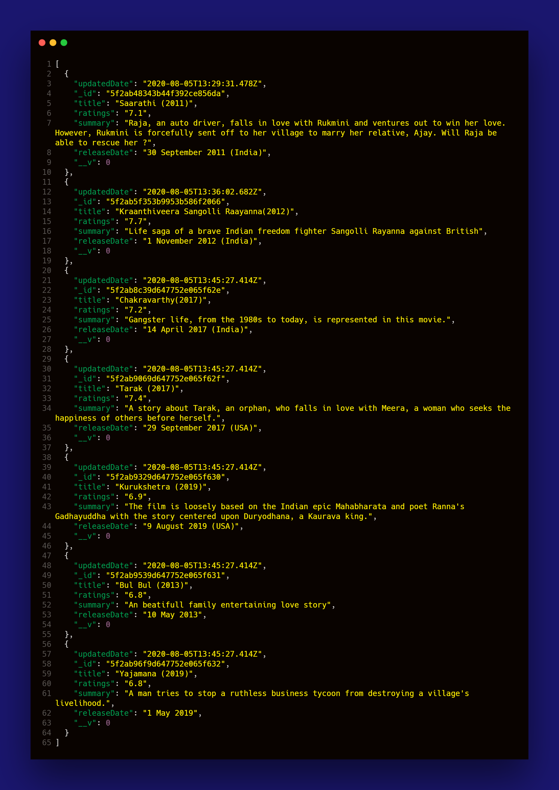

# MEAN stack Rest CollegeAPI

### Movies API lolxD 😉

CheckList:

- [x] Static
- [x] MongoDB Backend

## Run

```
# This project uses Denon
node run start app.js
```

## Working



## Routes

```
GET      /api/v1/movies 
GET      /api/v1/movies/:id
POST     /api/v1/movies 
PUT      /api/v1/movies/:id
DELETE   /api/v1/movies/:id
```
